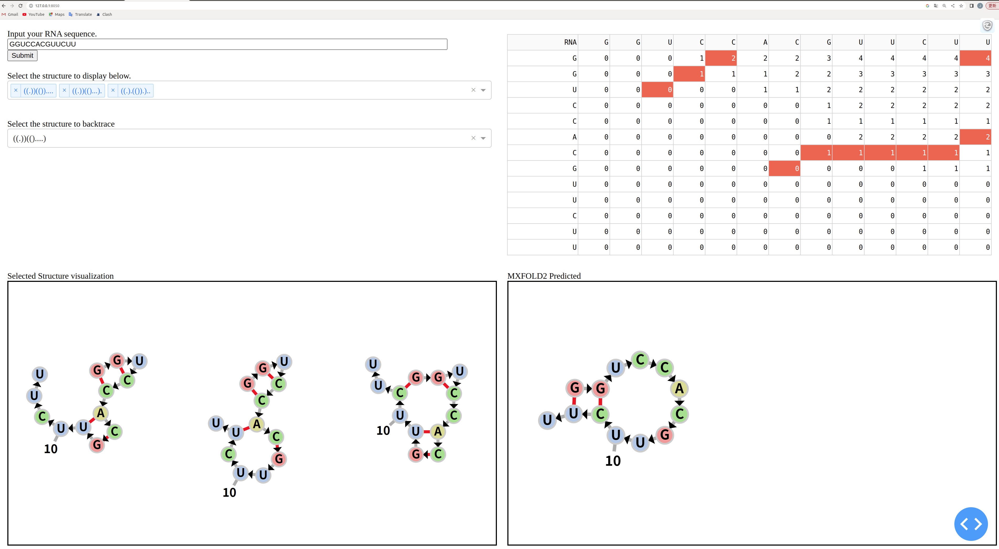

# Course_Nussinov_NN
Final project For UIUC CS466 

We implement a program which contain the Nussinov algorithm and integrate MXFold2.

## Install
*Please this code is tested on linux*

To get started, we recommand you to install conda and create a new virtual environment.
```
conda create -n nussinovnn python=3.8
conda activate nussinovnn
```
Then, you need to install the <a href="https://github.com/mxfold/mxfold2">MXFold2</a>. Please follow the instructions from the link. Also try to Test MXFold2 first by simply predict a RNA.

After that, you need to install several packages:
```
pip install -r requirements.txt
```
Finally, you can run the program!
```
python main.py
```
When running the program, you should see these from the terminal:


Open the address and enjoy our project!
